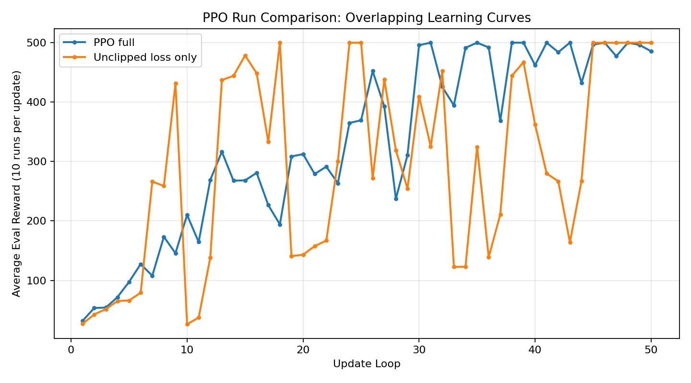

# PPO Evaluation Results

This file tracks evaluation results over 100 consecutive episodes for different agents.

## Results

| Agent | Training Status | Eval Episodes | Average Reward |
| --- | --- | --- | --- |
| Random Agent | Untrained (init model, no training) | 100 | 20.5 |
| PPO Agent | Critic trained with Monte Carlo return (sum of future rewards) | 100 | 168.05 |
| PPO Full | With training optimization | 100 | 472.77 |
| PPO Unclipped | Unclipped loss | 100 | 500 |

## Comparison Plot

Overlapping learning curves for `PPO full` and `Unclipped loss only`:

* The Blue Line (PPO Full): It climbs steadily and, crucially, stays at the maximum reward (500). This is "Convergence." The advantage normalization and clipping effectively prevented the model from making "suicidal" updates that would ruin its policy.

* The Orange Line (Unclipped/MC): This is the "Policy Collapse" I warned you about. Notice how it hits 500 (Update 16) and then immediately crashes back down to <200 (Update 17). Without the "Trust Region" (clipping), a single bad batch of data caused the weights to shift too far, and the agent forgot how to balance the pole. It had to relearn from scratch.